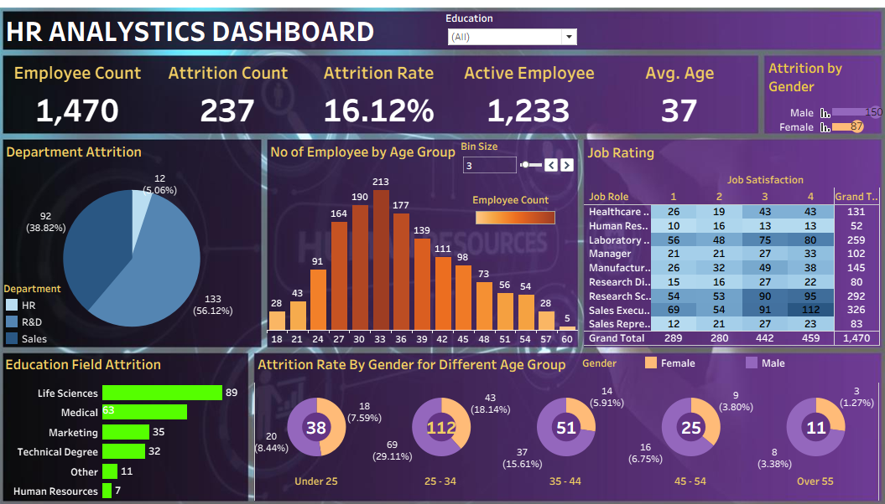

<!DOCTYPE html>
<html lang="en">
<head>
    <meta charset="UTF-8">
    <meta name="viewport" content="width=device-width, initial-scale=1.0">
    <title>HR Analytics Dashboard</title>
</head>
<body>

<h1>📊 HR Analytics Dashboard</h1>

<i>An interactive dashboard to analyze employee attrition, demographics, and workforce trends using data visualization.</i>

<h2 id="overview">📌 Overview</h2>

This project focuses on analyzing employee data to uncover insights related to attrition, workforce distribution, 
and employee demographics. The dashboard helps HR teams make data-driven decisions to improve employee retention 
and organizational performance.

<h2 id="objectives">🎯 Objectives</h2>
<ul>
    <li>Analyze employee attrition trends</li>
    <li>Understand workforce demographics (age, gender, department)</li>
    <li>Identify high-risk attrition groups</li>
    <li>Support HR decision-making with data insights</li>
</ul>

<h2 id="tools">🛠 Tools & Technologies</h2>
<ul>
    <li>Tableau</li>
    <li>Data Cleaning & Transformation</li>
    <li>Data Visualization</li>
</ul>

<h2 id="features">📊 Dashboard Features</h2>
<ul>
    <li><b>KPIs:</b> Employee Count, Attrition Count, Attrition Rate, Active Employees, Average Age</li>
    <li><b>Department-wise Attrition</b> analysis</li>
    <li><b>Age Group Distribution</b> of employees</li>
    <li><b>Job Role & Job Satisfaction</b> insights</li>
    <li><b>Gender-based Attrition</b> comparison</li>
    <li><b>Education Field Attrition</b> breakdown</li>
</ul>

<h2 id="dashboard">📸 Dashboard Preview</h2>

<h2 id="insights">📈 Key Insights</h2>
<ul>
    <li>Major attrition is observed in certain departments like Sales and R&D</li>
    <li>Employees aged 25–34 show higher attrition rates</li>
    <li>Gender-based attrition differences are noticeable across age groups</li>
    <li>Some job roles have lower satisfaction levels, leading to higher attrition</li>
</ul>

<h2 id="future">🚀 Future Improvements</h2>
<ul>
    <li>Predictive analytics for attrition forecasting</li>
    <li>Integration with real-time HR systems</li>
    <li>Advanced filtering and drill-down features</li>
</ul>

<h2>Author & Contact</h2>

**Pavan**  
Data Analyst  
📧 Email: psillal4321@gmail.com  
🔗 [LinkedIn](https://www.linkedin.com/in/pavan-479173238) 

</body>
</html>
